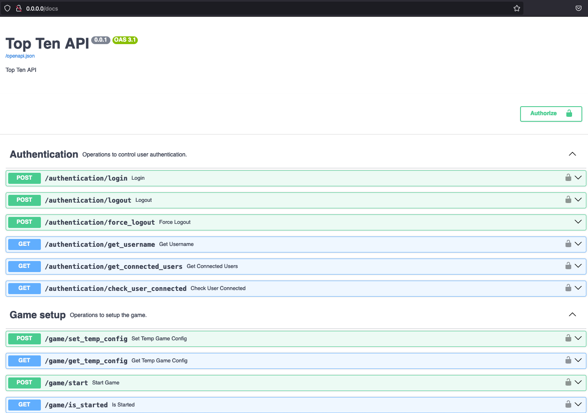
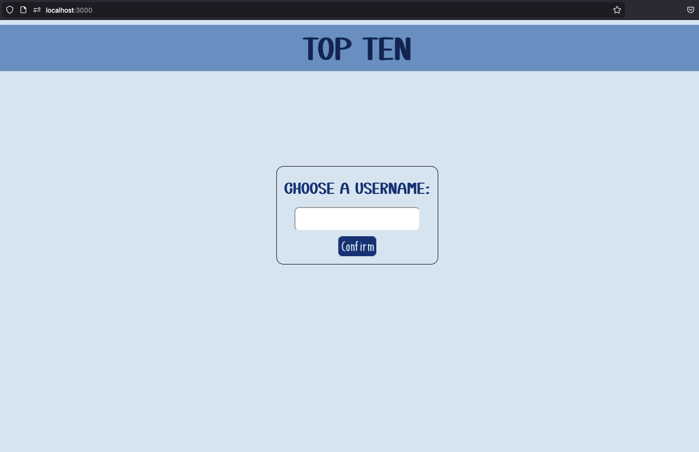

# Top Ten

Python and React-based implementation of ["Top Ten" game from Cocktail Games](https://www.cocktailgames.com/en/game/top-ten/).

**Table of Contents**

1. [Repositiory Structure](#repository-structure)
1. [Dependencies](#dependencies)
1. [Usage](#usage)
1. [Deployment](#deployment)
1. [Development](#development)

## Repository Structure

This repository is composed of three main parts:

1. A [Python Library](#python-library) that contains all the raw game logic.
1. A [Python REST API](#python-rest-api) that exposes the game interactions over a REST API.
1. A [React Frontend](#react-frontend) that provides an interactive user interface to play the game.

### Python Library

The Python Library is contained in the [lib](lib) folder. It implements the game logic as classes, one for the `game` instances, one for the `round` instances and some classes to hold data for the themes and player propositions.

Another part of the library is the database (the list of themes made available to the game). This database is contained in the [database](database) folder.

### Python REST API

The Python REST API is contained in the [app](app) folder. It is based on FastAPI. It exposes all useful game logic from the [Library](#python-library) to allow users to play a game via `POST` and `GET` calls.

It also handles most of the login logic. For example, it ensures that users are connected when playing and that there are no duplicate users.

This can be called the backend of the whole game. A single instance of that API is run for the full game.

### React Frontend

The React Frontend is mainly contained in the [frontend](frontend) folder. It is a React app that creates a Graphical User Interface via web browsers.

It will talk to the [REST API](#python-rest-api) to handle the game logic while allowing users to interactively play the game.

There will be one instance of the Frontend run by each user/player that wants to play the game.

## Dependencies

### Python Dependencies

All dependencies are listed in the [requirements.txt](requirements.txt) file. We suggest using [Python virtual environments](https://docs.python.org/3/library/venv.html).

```shell
python3 -m venv venv
source venv/bin/activate
pip install -r requirements.txt
```

### React Dependencies

This project uses [npm](https://docs.npmjs.com/downloading-and-installing-node-js-and-npm). All dependencies are listed in the [package.json](frontend/package.json) file.

```shell
cd frontend
npm install
```

## Usage

### Try Out Game From CLI

To simply test the [game library](#python-library) in the most basic way, one can use the [main_cli](main_cli.py)
Command Line Interface script.

The user will be prompted with steps to follow in order to create and play a test game.

### Start The Python REST API

To start the [REST API](#python-rest-api), one should use one of the following:

```shell
python main_rest_api.py --ip 0.0.0.0 --port 80
```

or equivalently:

```shell
uvicorn app.app:top_ten_app --host 0.0.0.0 --port 80
```

Once the REST API started it can be used with a basic Swagger interface via a web browser at the provided IP address.



### Start The Main User Interface

The main user interface is the [React Frontend](#react-frontend), before using it, one should have started the REST API.

To start the frontend, one should use:

```shell
cd frontend
REACT_APP_LOCAL_TESTING=true npm start
```

A new tab will open in your browser showing the main page (login page) of the game.



As long as it is running, the frontend will be available via http://localhost:3000.

## Deployment

The REST API and React Frontend are both automatically deployed (from main branch).

- The [REST API](#python-rest-api) is deployed using [render.com](https://render.com) at the following address: [top-ten-rest-api.onrender.com](https://top-ten-rest-api.onrender.com)
- The [React Frontend](#react-frontend) is deployed using [netlify.com](https://www.netlify.com) at the following address: [top-ten-game.netlify.app](https://top-ten-game.netlify.app)

## Development

### Pre-commit Hooks

```shell
pre-commit install
```
